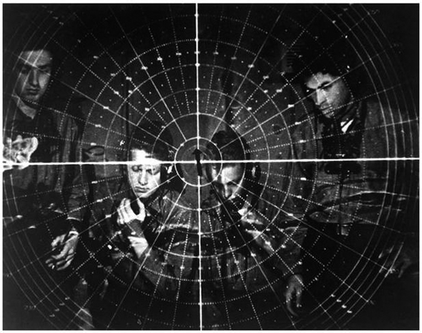
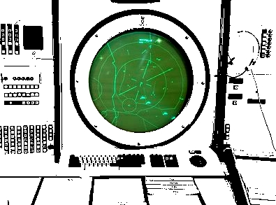

 

## ADS-B virtual radar monitor

A simple ADS-B monitoring system using an RTL-SDR dongle, a Raspberry Pi and the Dump1090-mutability software.

**Some configuration steps that may or may not be essential**:

- Expand the file system
- Set new password for user pi
- Save appropriate password for wifi, etc
- Activate SSH
- Un-install Wolfram, LibreOffice, etc
- Enable autostarting without login, and static IP address
- Enable "stop"-button , demon and script
- Setup cronjob that does a nightly reboot
- Set the LAT and LON variables for your location, and JSON_LOCATION_ACCURACY to "exact" in file */etc/default/dump1090-mutability* .

***

See project's write-up at http://xneb.org/mabe/xnebmisc/home/ads-b.html or https://sites.google.com/view/xneb-project-logs/home/ads-b

 
